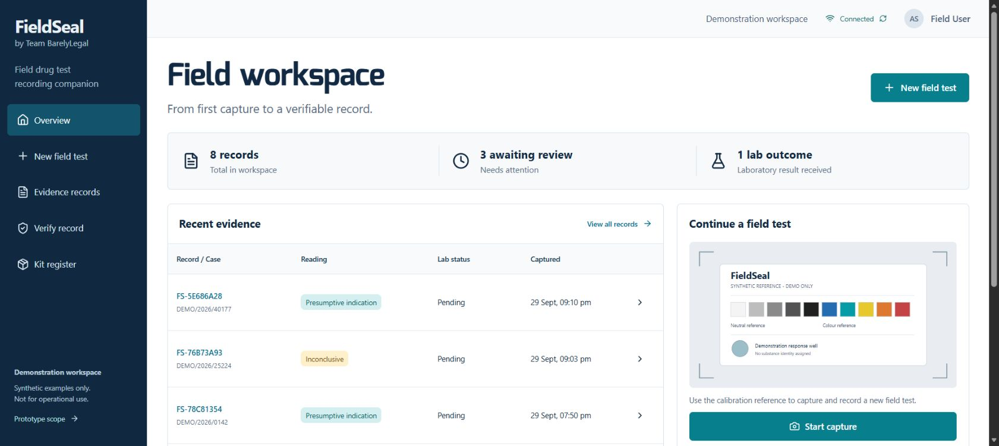
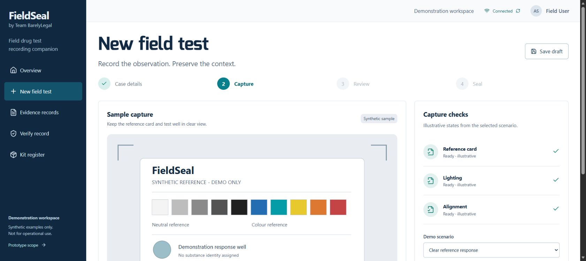
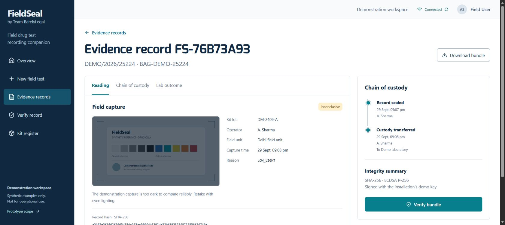

# FieldSeal

Field drug-test recording companion for SIH 26231, Team BarelyLegal (156945).

A working local prototype with a React/TypeScript interface, FastAPI API, SQLite persistence, signed evidence exports, custody events and an offline draft queue. The dashboard, capture workspace and evidence detail are connected screens. No external AI service or paid API is required.

**Demonstration only:** outcomes come from explicitly synthetic scenarios. Uploaded photos always require manual review. No drug classifier, accuracy claim, agency endorsement or legal-admissibility guarantee is made.

## Prototype screenshots

These are screenshots of the running application with fictional demonstration records.

### Dashboard

Recent records, review queue, laboratory status and the field-test entry point.



### Capture workspace

Guided capture with a synthetic calibration reference and explicit quality-review scenarios.



### Evidence detail

The recorded capture, case context, custody trail and bundle-verification action.



## Run on Windows

Install Python 3.10+ and Node.js 22.12+ (Node 24 is also supported), then open PowerShell in this directory:

```powershell
.\Start-FieldSeal.ps1
```

The script creates a local virtual environment, installs dependencies, builds the frontend and starts the application. Open **http://127.0.0.1:8778/**. API documentation is at **http://127.0.0.1:8778/docs**. Stop with Ctrl+C. It binds only to this computer.

Manual setup on Windows/macOS/Linux:

```text
python -m venv backend/.venv
# Activate the virtual environment using your platform's activation command.
python -m pip install -r backend/requirements-dev.txt
cd frontend
npm ci
npm run build
cd ../backend
python -m uvicorn app.main:app --host 127.0.0.1 --port 8778
```

For frontend development, run `npm run dev` in `frontend` alongside the API. Vite serves port 5178 and proxies the API.

## Demonstrate

1. Open the dashboard: six fictional seed records include an inconclusive capture and a lab result that differs from the initial reading.
2. Start a field test; fill example details and select an in-date kit. An expired kit blocks progression.
3. Select a synthetic capture scenario. Low light and missing reference produce an inconclusive state. A real photo is recorded without an automated substance prediction.
4. Review and seal. The API persists the record and signs its immutable payload.
5. Append a custody handover or manually link a laboratory outcome. The original field reading stays intact.
6. Download the signed JSON bundle. In Verify record, check an intact bundle, then enable the tamper demonstration; the modified copy fails verification.
7. Start another test and enable Demonstrate offline queue before sealing. It stays unsigned locally. Click the connection indicator to synchronize it once; repeated sync uses the same client identifier to prevent duplicates.

Offline storage uses IndexedDB in the current browser. The loaded app can retain drafts and cached records; this release does **not** install a service worker or guarantee cold-start loading without a network connection.

## Project structure

| Path | Purpose |
| --- | --- |
| `frontend/src` | Connected screens, responsive styles, IndexedDB queue, API client |
| `backend/app/main.py` | Input validation, transactional SQLite storage, signatures and verification |
| `backend/tests/test_api.py` | Integration checks against an isolated temporary database |
| `docs/ARCHITECTURE.md` | Data model, trust boundary and PostgreSQL migration plan |
| `docs/VALIDATION.md` | Checks performed and remaining limits |
| `output/pdf/Drug Testing - Corrected.pdf` | Corrected seven-page submission concept deck |

## Checks

```text
cd backend
python -m pytest -q
cd ../frontend
npm run build
```

An optional GitHub Actions workflow is provided at [`docs/ci/checks.yml`](docs/ci/checks.yml). To enable it, copy it to `.github/workflows/checks.yml` using an account or token authorized to publish workflows. Automated Actions checks are not enabled in this initial publication. The source package includes the prototype screenshots and excludes databases, private signing keys and installed dependencies.

## Data and deployment

On first startup, `backend/data` receives a SQLite database and an installation-specific ECDSA demonstration key. Set `FIELDSEAL_DATA` to change the location. Keep the database and key together; deleting the key loses the installation's signing continuity. Do not use real evidence or personal records in this prototype.

This is not a public production deployment: there is no user authentication, device attestation or encrypted evidence storage. See [SECURITY.md](SECURITY.md). PostgreSQL deployment is documented as a future migration, not claimed as implemented. No project license has been selected; dependency licenses remain with their respective authors.
