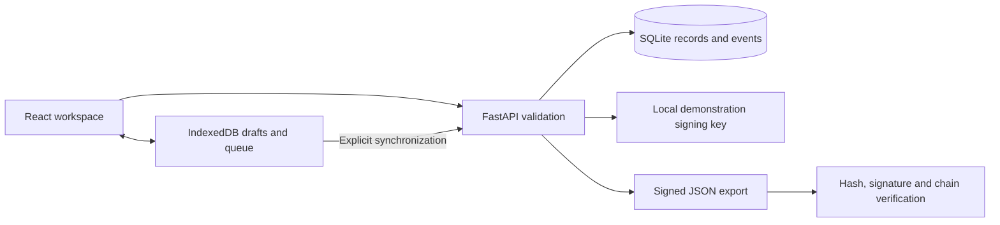

# Architecture and trust model

## Data model

`records` stores an immutable JSON payload, unique client sync identifier, record identifier, SHA-256 digest and ECDSA signature. The payload contains intake fields, a snapshot of the selected kit, synthetic result or uploaded-photo manual-review state, photo digest and sealing time.

`events` stores `(record_id, sequence)` as a composite key. Each event includes its predecessor's hash, action, actor label, details and timestamp, with a separate digest and signature. Custody and laboratory events append under a SQLite write transaction; there are no update/delete record routes. A second lab outcome is rejected rather than silently replacing the first.

The signed bundle envelope contains the original signed record, ordered events and export time. Signing the envelope also protects the exported event-list length. Verification checks the envelope, payload and each event, then compares the supplied public key with this installation's key. No public registry or hardware-backed trust anchor is implied.

## API

| Route | Behavior |
| --- | --- |
| `GET /api/health` | Demo mode and signing fingerprint |
| `GET /api/kits` | Synthetic kit registry and expiry |
| `GET /api/records` | Records ordered by capture time |
| `POST /api/records` | Validate, sign and persist; client-ID retry is idempotent |
| `GET /api/records/{id}` | Original payload plus custody/lab events |
| `POST /api/records/{id}/custody` | Append signed handover |
| `POST /api/records/{id}/lab` | Append a manually entered lab outcome |
| `GET /api/records/{id}/bundle` | Signed JSON envelope |
| `POST /api/verify` | Integrity result, trust-key match and errors |

## Offline behavior

The browser stores drafts, cached records/kits and queued intakes in IndexedDB. Queued intakes are **unsigned**. On sync the server validates the current kit and signs the accepted intake. A unique `client_id` prevents duplicates after interrupted retries; reusing an identifier with different content returns HTTP 409. Invalid queued records remain queued with an error. The application shell has no service worker in v0.1.

## PostgreSQL migration plan (not implemented)

Replace the direct SQLite repository with a SQLAlchemy/Alembic repository. Preserve unique client IDs and the `(record_id, sequence)` constraint; allocate sequences inside a transaction with a row lock. Use JSONB for canonical payload copies while keeping the exact canonical signing representation unchanged. Move photo bytes to encrypted object storage and sign their content digests. Store keys in a managed signing service, not database rows. Add authenticated roles and audit every export, including key IDs and rotation metadata. Test migration against signature-preserving fixtures before importing any records.

For the submission, a single Uvicorn process serves both built static assets and API on port 8778. No PostgreSQL driver or production deployment is falsely implied by the prototype.
